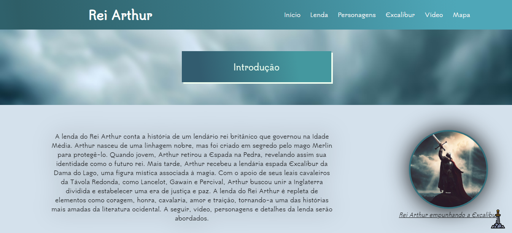
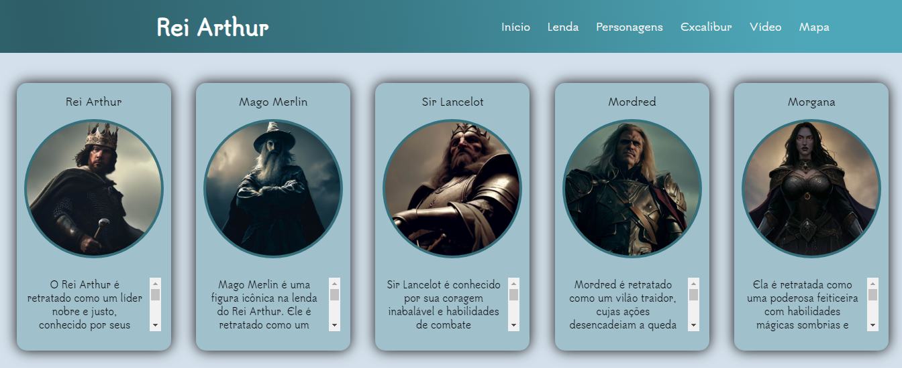
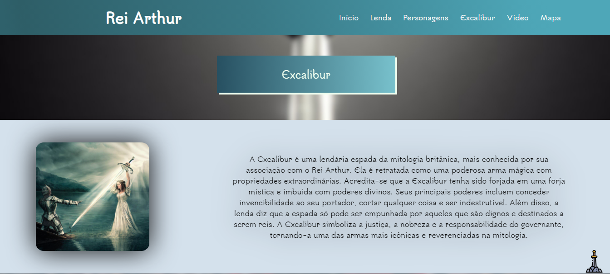

# Projeto Desenvolvimento Front-End

Olá! 👋

Este repositório traz consigo o projeto final de Desenvolvimento Front-End do IFSP (Instituto Federal de São Paulo). Neste site, o tema abordado é a lenda do Rei Arthur, contando com curiosidades, vídeo, personagens e, claro, a sua história.

## Linguagens utilizadas

**Front-end:** HTML, CSS, JavaScript

## Funcionalidades

- Menu responsivo;
- Slides de textos e imagens;
- Zoom em figuras.

## Screenshots

## Demonstração

## Link

Clique <a href="https://pedrolauton.github.io/ifsp-projeto-final-dev-front/">aqui</a> para abrir o site! 

